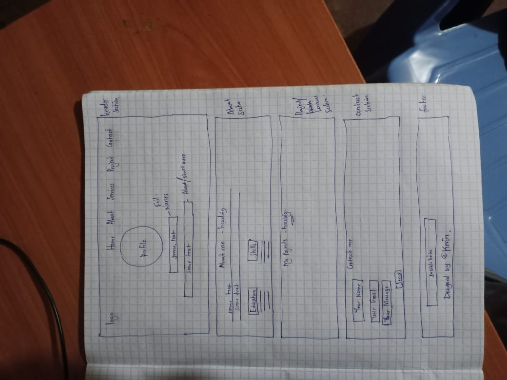
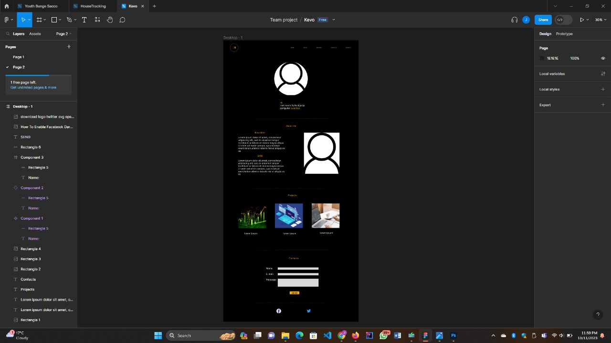

# Preparation for Capstone Project

## Personal Portfolio Website
### Objective
1. To Design and implement a visually appealing and user-friendly website layout.
2. To Include sections for an “about me”, skills, projects, and contact information.
3. Display my projects with brief descriptions, images, and links to live demos or source code repositories

### Project Overview:
The project is a personal portfolio website to showcase my skills learned so far.
My aim is to reach out to like-minded individuals so we can foster team collaboration on projects or ideas.

### Features and Functionality:
Getting in touch

### Technologies Used:
HTML, CSS, JavaScript

### Screenshots or Demo:
Sketch of how my portfolio would look like 

### Roadmap and future enhancements:

### Contact information
Do share with me. My name is Kevin Kirop.
-You can reach me via:
> [x](x.com/@/KevinKurkut)
> [Email](kevinkurkut@gmail.com)

[dggg]: im